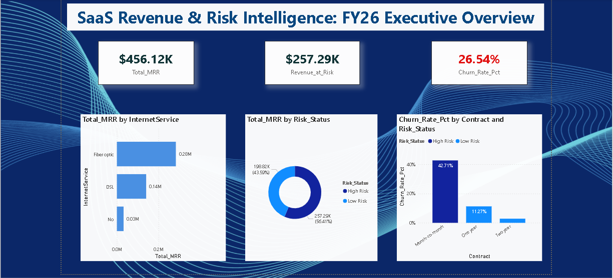

# SaaS Growth & Revenue Intelligence System
 

###  Executive Dashboard Preview

## Project Objective
This project marks a strategic shift from reactive data viewing to proactive revenue risk management. Using a raw, 7,043-record tracking dataset, I designed and implemented an end-to-end data pipeline to clean volatile infrastructure inputs, architect a relational Star Schema, compute non-negotiable SaaS performance indicators (KPIs), and construct an interactive executive dashboard outlining retention solutions.

## Architecture & Multi-Tool Folder Structure
The repository is separated into three specialized layers to showcase full-stack analytical versatility:

*  **`01_Data_Engineering_Python/`**: Programmatic ingestion and data cleaning logic.
*  **`02_Relational_Database_SQL/`**: Structural DDL schemas and complex query aggregations.
*  **`03_Business_Intelligence_PowerBI/`**: Visual modeling, DAX measures, and dashboard proofs.

---

## Execution Framework & Layer Breakdown

### Layer 1: Data Engineering & ETL (Python / Pandas)
* **Target File:** `01_Data_Engineering_Python/clean_data.py`
* **Technical Hurdle Overcome:** Identified that the `TotalCharges` field was improperly read as an object/text data type due to hidden empty string characters (`' '`), causing standard database imports to fail.
* **Resolution Logic:** Used `pd.to_numeric(errors='coerce')` to force the text string arrays into aggregable floats, filling resulting null entries with `0` to lock in mathematical continuity.
* **Database Normalization:** Normalized the flat dataset into a 3-table Star Schema architecture (split across Core Customers, Subscriptions, and Services) to minimize operational record redundancy.

### Layer 2: Database Architecting & KPI Analytics (SQL)
* **Schema Definition:** `02_Relational_Database_SQL/Database_Schema_Setup.sql`
* **Analytics Scripts:** `02_Relational_Database_SQL/SaaS_KPI_Analysis.sql`
* **Relational Constraints:** Instantiated the `saas_growth_db` database mapping out distinct data types (`VARCHAR`, `INT`, `FLOAT`), enforcing primary-to-foreign key relationships to link dimension records.
* **Core Business Logic Queries:** 
  * **Monthly Recurring Revenue (MRR):** Extracted predictable ongoing cashflow by summing monthly fees where customer churn was recorded as 'No'. **Result: ~$456.12K**
  * **Churn Rate Percentage:** Computed absolute customer attritions. **Result: 26.54%**
  * **Average Revenue Per User (ARPU):** Tracked unit profitability per active customer profile. **Result: ~$61.27**
  * **Structural Risk Identification:** Grouped data by billing contracts, exposing a severe vulnerability: **Month-to-Month contracts suffer a 42.71% churn velocity**, compared to a stable 2.83% for two-year plans.

### Layer 3: Business Intelligence & Semantic Workspace (Power BI & DAX)
* **Visual Evidence:** `03_Business_Intelligence_PowerBI/Dashboard_Preview.png`
* **Formula Mapping:** `03_Business_Intelligence_PowerBI/DAX_Logic_Revenue_At_Risk.png`
* **Semantic Modeling:** Designed a professional navy-and-white theme using cross-filtering mechanics to allow dynamic slicing. Implemented strict interaction constraints so high-level KPI cards isolate active accounts while historical trend charts retain aggregate views.
* **Advanced DAX Formulas:** Formulated a custom **Revenue at Risk** measure that calculates the financial impact of high-risk segments (combining Month-to-Month timelines with Fiber Optic services) multiplied by their baseline transactional churn probabilities.

---

## Strategic Recommendations Formulated
1. **Contract Optimization (Billing Shift):** Because monthly customers are roughly 15x more likely to leave than long-term subscribers, the business should implement a targeted 10% discount incentive to drive users toward annual billing layers.
2. **Technical Support Bundling (Service Mitigation):** Fiber Optic users drive high revenue brackets but register elevated churn numbers. Proactively offering dedicated service bundles or regular technical performance check-ins will reduce platform friction.
3. **Early Retention Sequences (Onboarding):** Establish automated check-in milestones for accounts within their first 90 days, as records indicate the highest customer loss occurs inside this introductory usage window.

---

## Future Scalability Roadmap
* **Pipeline Automation:** Transition from manual export files to automated data insertion using Python's `SQLAlchemy` package to directly stream transformations from the notebook into the relational database engine.
* **Predictive ML Extensions:** Integrate a localized Logistic Regression model via `scikit-learn` to proactively flag individual accounts with high churn probabilities before they request cancellations.
